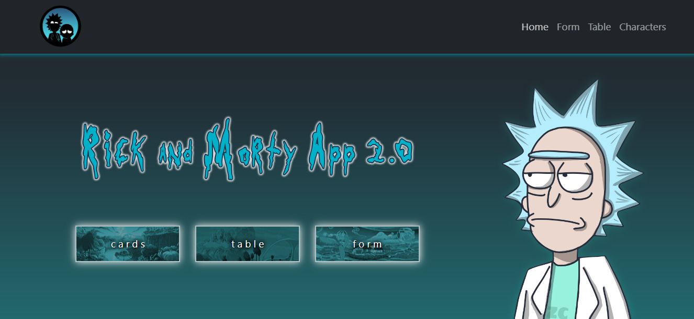

---


---

Exercise website for React course in Skill Factory - Avalith




## Technologies used

      	 


## Team

| Fran|  Mel | Will | Fabri|
| :---: | :---: | :---: | :---: |

---

## Welcome to our project

||This project was created with [Create React App](https://github.com/facebook/create-react-app)|
| :---: | :---: |
  


## How to run our site

For this tutorial on how to set up and run our project we recommend using Visual Studio Code with its integrated terminal.

##### One of the easiest ways to do this, is to do as follows:

First copy the repository HTTPS address.

|

Then we should position ourselves in the directory we want our folder to be downloaded

Next, clone our repository using git clone + the HTTPS address.
Type in the Git terminal:

```
git clone https://github.com/fyunes/skillfactory-second-project.git 
```

A folder will be created, access it by typing the following line in the terminal:

```
cd skillfactory-second-project
```

After that, you should install all dependencies for it to work properly running the following command:

```
npm install
```

If you do not wish to install them globally and to reduce long time issues you may also run:

```
npx install
```

###### Now you simply must enter

```
npm start
```

Then the app should start running smoothly without any issues.

### Happy hacking!

* * *

The science behind our site!
----------------------------

We are a team of four members. We decided to use an Agile methodology (SCRUM) for the development of this project. 

 

#### Our method consisted in:

* Having a daily meeting on Discord, where we talked about what we wanted to develop and how we could achieve our goals for the site. 

* Using live coding and pair programming as our tools for fixing bugs and helping each others when difficulties arrived. 

* Using text-channels on Discord to discuss changes and errors on our code. One of our most important tools was constant feedback among the team.

# Project structure

#### Navbar and footer:

Our responsive navbar uses React-Router for navigation, instead of the regular HTML `<a>` tags. Using the navbar, you can go to Home, Form, Table, and Characters. 

Our footer shows you who developed the project, and uses `<a>` tags that allow you to check out the team members' GitHub profiles without leaving our page.

###### Special thanks to Mel and Fabri! 


#### Home page:

We designed a responsive landing page for the user to navigate the site. 
On this page, you can see 3 clickable buttons (cards, table, form), and it's Rick and Morty themed!  

###### Special thanks to Mel and Fabri! 

#### Form page:

Our form allows you to send a message which is printed on the site (DOM) when you press the send button. It includes styled validation on each input field (Name, Phone, Email). 
Try sending something and check out how cool our form is!

###### Special thanks to Fabri! 

#### Table page:

This table shows you info from the `jsonplaceholder.typicode.com/users` API; it simulates a group of users and their data: Name, Email, City, Phone, Website, and ID. It was developed using Axios! 

###### Special thanks to Williams! 

#### Characters page:

This is our characters page! Every creature from the Rick and Morty series is here, thanks to the `rickandmortyapi.com` API. 
You can use the search bar to look for something in particular! You can also use filters if you're being very specific. 
###### Try writing "Rick" and check out how many Ricks you can find! Isn't that awesome? 
 
Check out all the characters using the navigation buttons below the cards. Don't worry if it takes some time to load, you'll know when that happens, we got you covered with our loader animation! 

###### Special thanks to Fran, our Team Lead and SCRUM Master! 

----------------------------

### Thank you for visiting our project!  
###### Try not to fall into a portal when leaving 


